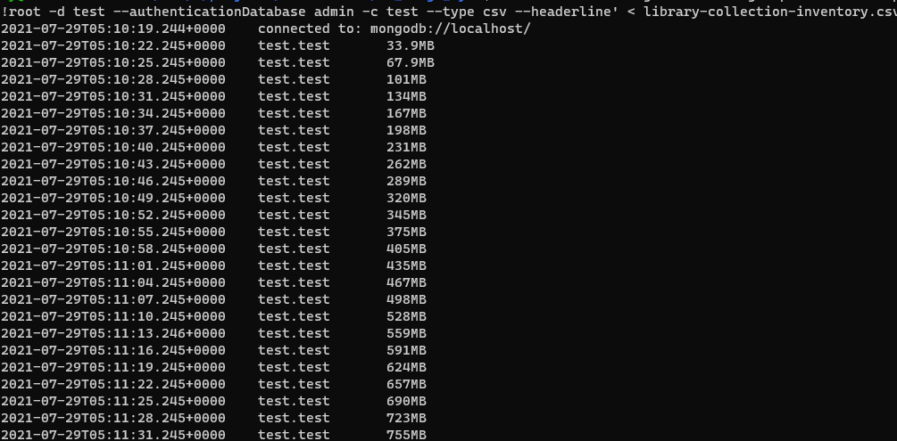
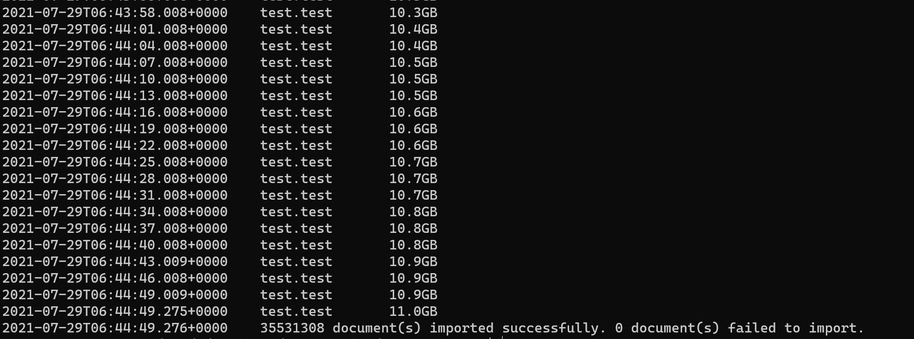
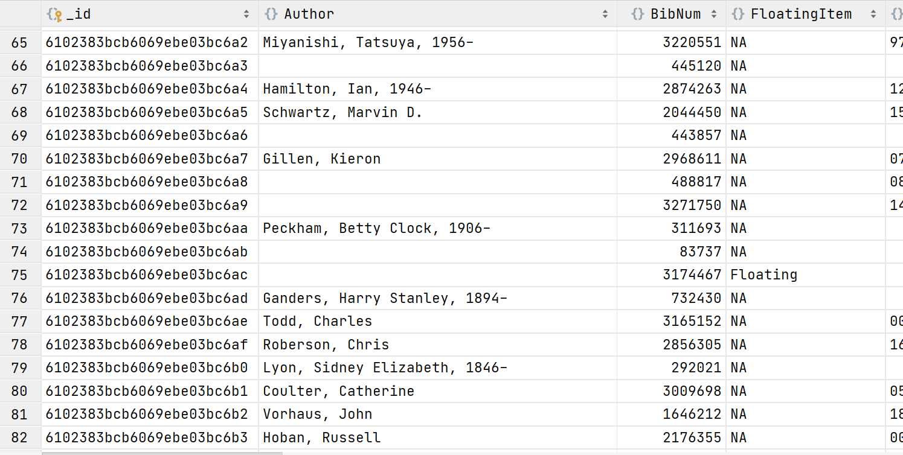
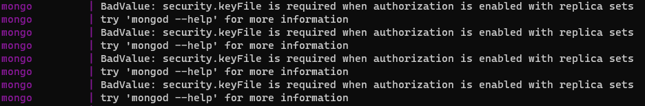
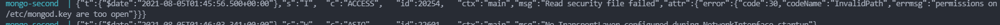
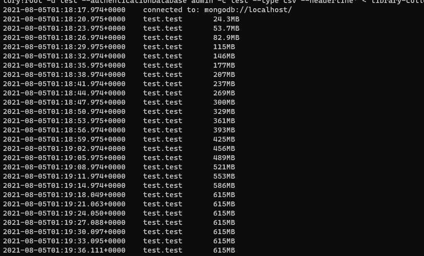

# mongoDB 및 elasticsearch 연동
last update 2021.07.29
* * *
#### 구성요소
+ MongoDB
+ Monstache
+ Docker-compose
+ Elasticsearch
+ 쉘 스크립트
#### 파일시스템 구조
```bash
es-mongo-sync
├ elasticsearch                 
    └ monstache.config.toml     # monstache 동기화 세팅 설정파일
├ setup-rspl
    ├ Dockerfile                # replicaset 구성을 위한 build파일
    ├ replicaSet.js             # replicaset 구성 설정
    └ setup.sh                  # docker 몽고 커맨드용 스크립트
├ docker-compose.yaml           # docker-comopse 구성
└ readme.md
```
## 내용
1. 컨테이너 시작
```bash
$ docker-compose up -d
```
2. mongoDB에 데모데이터 삽입
[캐글데이터 예시](https://www.kaggle.com/city-of-seattle/seattle-library-collection-inventory?select=library-collection-inventory.csv)
```bash
$ docker exec -i mongo sh -c 'mongoimport -u root -p factory!root -d test --authenticationDatabase admin -c test --type csv --headerline' < library-collection-inventory.csv
```




3. mongoDB 인증 이슈 해결 (계정 생성 또는 keyFile 생성)
[참고자료](https://granger.tistory.com/18)

4. 

* * * 
## 이슈
#### mongoDB 인증 관련 오류

+ keyFile 생성
+ keyFile 권한 문제 발생


#### replSet 문제
#### 데이터 삽입 시 속도저하 발생

